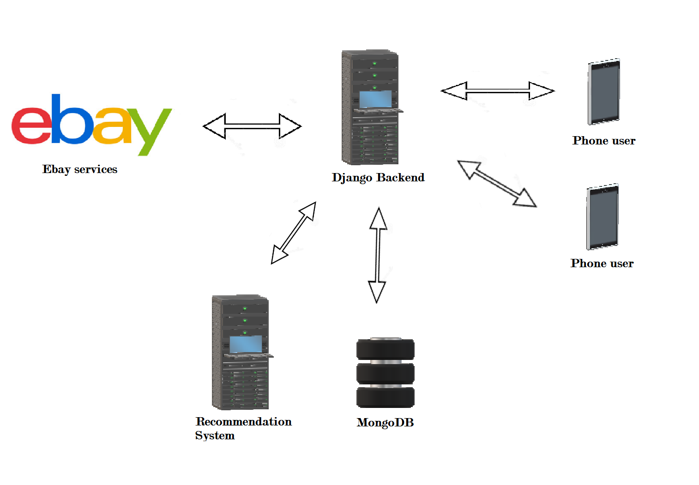

# Advanced Programming Languages : 
## Ebay Price Tracker

---

### Un progetto di:
- Bartolomeo Caruso (1000008726)
- Gabriele Costanzo (1000014221)
- Giuseppe Fallica (1000013477)

---

## Indice
- ### TL;DR: Come avviare il progetto
    - Istruzioni rapide per l'esecuzione del progetto sul proprio computer
- ### 1. Ebay Price Tracker
    - Considerazioni generali sul progetto: descrizione, scopi, funzionamento, sviluppi futuri
- ### 2. Considerazioni Preliminari al Progetto
    - Backlog pre-lavori dei progetti individuati e motivazioni per la scelta di Ebay Price Tracker

---

## TL;DR : Come avviare il progetto

Il progetto consta di tre parti:
- un web server backend Django (**Python**) su database MongoDB
- un Recommendation System a scheduled task (**R**)
- un app client per smartphone (Android/iOS) su Xamarin con simulatore (**C#**)

Ogni parte è contenuta in una cartella dedicata, con un **README.md** che documenta il lavoro svolto su di essa e le istruzioni per il suo avvio manuale.

- **Dependencies:**

Prima di poter avviare il progetto, ci si assicuri di avere le seguenti dependencies installate sul proprio computer e il rispettivo eseguibile visibile a livello di bash/command prompt (i.e. le cartelle `/bin` sono già state incluse nel PATH di sistema):
- **Python 3.9**, con `py -3` o `python3`
- **MongoDB 4.0+**, con `mongod` e `mongo`
- **MongoDB Database Tools**, con `mongoimport`
- **R 3.6+**, con `R` e `Rscript`
- **ngrok**, con `ngrok`

- Inoltre, è richiesta l'installazione di **`Xamarin`** per il test del client con simulatore **Android/iOS**.
    - Questo package è distribuito, sia su Windows che su macOS, tramite `Visual Studio`.
    - Poiché il simulatore potrebbe richiedere un **tunneling HTTP** per funzionare, anziché adottare il semplice `localhost`, si richiede anche di installare `ngrok` e creare un account (https://ngrok.com/)

Il pieno rispetto di queste dependencies e di questi nomi permette inoltre l'utilizzo di un set di script per `bash` su UNIX (`.sh`) e `command prompt` su Windows (`.cmd`), prodotto nel tentativo di fornire uno strumento semplice per l'inizializzazione, start e stop del progetto nel suo complesso.

Ogni file discusso qui di seguito è stato testato con le seguenti call da terminale:

- **macOS:**

    ```bash
    $ sh script.sh
    ```
- **Windows:**

    ```
    script.cmd
    ```

Allora, sono richiesti i seguenti step:

- **1: Setup dell'environment:**

    Per effettuare il tunneling richiesto dal simulatore di Xamarin:
    ```
    ngrok http 8000
    ```
    per ottenere un indirizzo del tipo:
    ```
    http://675db8cd4c17.ngrok.io
    ```
    che effettui il tunneling a `http://localhost:8000`.


    Tenendo a "portata di mano" sia l'url di `ngrok`, sia il `EBAY_APP_ID` fornito dagli sviluppatori, si può adesso eseguire:

    ```
    setenv.cmd/sh
    ```
    Questo script si occupa di adattare le call di `python`, `mongod` e `R` all'ambiente dell'utente, richiedendo il termine preferito (i.e. alcuni utenti avranno settato l'eseguibile di Python 3.9 come `python3`, altri come `py -3`, e altri ancora vorranno passare dei parametri dopo `mongod`).

    Inoltre, si chiede all'utente l'input dei parametri per il file `.env` di Django, dei quali solo l' `EBAY_APP_ID` (fornito separatamente dalla repository) è obbligatorio, mentre gli altri parametri verranno settati automaticamente coi valori di default premendo INVIO.

    Si richiede anche l'url di `ngrok` che verrà inserito su `Xamarin/XamarinFrontEnd/Configuration/secrets.json`.
    
    Il processo di `ngrok` dovrà rimanere aperto per tutto il tempo del testing del progetto.

    In questa fase si può già aprire un process in background di `MongoDB` con `mongod`, ma in alternativa verrà aperto in fase di `start`.

- **2: Start dei lavori:**

    Nel caso di `macOS` o `Ubuntu`, è necessario assicurarsi che il processo `cron` sia avviato e coi permessi superuser.

    ```
    sudo cron
    ```

    Su Windows non è necessario nessun passo iniziale per gli scheduled task.

    Poi, a seguire:

    - In un terminale:
    ```
    start.cmd/sh
    ```

    - In un secondo terminale:
    ```
    startR.sh/cmd
    ```

    Questa combinazione si occupa di:
    - solo se è la prima installazione:
        - installare le dependencies di Python 3.9 da file `requirements.txt`
        - aprire un'istanza di server MongoDB
        - effettuare le `migrations` richieste da Django
        - popolare MongoDB con un dataset di partenza a partire dai `.json` nella cartella `Django/utilities`
    - avviare Django
    - avviare lo script `main.R`

    Il primo dei due terminali rimarrà aperto per mostrare l'output di Django, dal quale sarà possibile verificare la ricezione di richieste sugli endpoint `/communication/` da parte del cron job del Recommendation System.

    Il secondo verrà chiuso una volta completata la ricezione di tutte le osservazioni e l'invio di tutte le recommendation calcolate, e dopo l'aggiunta del cron job.

    **ATTENZIONE! Su Windows, se in questa fase dovesse risultare un errore nel terminale dedicato ad R, potrebbe essere relativo ad un limite di Windows di 261 caratteri per il corpo del cron job. Si consiglia di ritentare dopo aver rinominato la folder del progetto a qualcosa di breve, i.e. "apl2021", per diminuire la dimensione del testo passato.**

    I log di MongoDB e del task schedulato possono essere visionati inoltre, rispettivamente, sui file di testo `mongod.log` e `Rserver/task.log`.

    - **Start del client:**
    
        Lo start del client può essere avviato in diversi modi:
        - se si apre il progetto da `Visual Studio`, assicurandosi di aver installato `Xamarin` e i rispettivi SDK `Android` e/o `iOS`, è possibile usare una delle configurazioni di `build` per avviare il simulatore del dispositivo smartphone, e interagire con l'app.
        - se si dispone di dispositivo `Android`, collegandolo via USB al PC e aggiungendo il permesso di `deploy` nel `Configuration Manager`, Visual Studio proverà ad individuare automaticamente il dispositivo, ed effettuando il `Run` con la configurazione che ha lo stesso nome del dispositivo, sarà possibile testarlo Live su hardware senza simulatore.

- **3: Stop dei lavori:**

    Per fermare Django, sarà sufficiente premere CTRL+C nel terminale rimasto aperto, o - su Windows - chiuderne la finestra.

    Il cron job di R terminerà dopo 10 tentativi falliti di connessione al backend Django, ma può essere forzato eseguendo:
    ```
    stop.sh/cmd
    ```
    che tra le altre cose chiude anche la connessione di MongoDB.

- **EXTRA: Pulizia del progetto:**

    Esiste inoltre uno script per la pulizia del progetto, per riportarlo ad uno stato paragonabile a prima dell'avvio del primo `start.sh/cmd`, lasciando intatti i file di environment.

    ```
    clean.sh/cmd
    ```

    **ATTENZIONE! Questo script esiste principalmente per debugging e riproducibilità, ma contiene call potenzialmente pericolose quali "db.dropDatabase()" che potrebbero avere comportamenti imprevisti se i file di env non sono stati settati correttamente. Si consiglia un double-check del file ".env.sh/cmd" generato nello step 1.**


---

## 1. Ebay Price Tracker
Ebay Price Tracker è un'applicazione che consente ad un utente di cercare prodotti della piattaforma Ebay e di inserirli all'interno di una propria lista personale di prodotti osservati, indicando per ciascun prodotto desidato un prezzo di soglia.

Periodicamente la nostra applicazione utilizzerà le API di Ebay per aggiornare tutti i prezzi dei prodotti contenuti nel nostro database, e farà in modo da notificare un utente nel caso in cui il prezzo di uno specifico prodotto desidato si sia abbassato al di sotto della soglia stabilita in precedenza dell'utente stesso.

Un'ulteriore obiettivo di tale progetto è di mettere l'utilizzatore al corrente dell'andamento dei prezzi del prodotto ricercato, in modo tale da non farsi ingannare da finti sconti che solitamente vengono proposti durante periodi come il black friday: sempre mediante l'uso delle API di ebay la nostra applicazione salverà la variazione dei prezzi di ciascun prodotto, in modo da restituirla sotto forma grafica all'utente durante la sua ricerca.

Infine il nostro applicativo prevede la presenza di una sezione apposita di prodotti consigliati all'utente: sulla base dei prodotti desiderati dagli utilizzatori il nostro sistema di raccomandazione elaborerà per ciascuno di essi una lista (aggiornata periodicamente) di prodotti consigliati, permettendo agli utenti di inserirli nella loro lista dei desideri.

Per raggiungere tali obiettivi il nostro progetto prevede tre elementi fondamentali:
- **Backend Django**: un backend scritto in Python i cui compiti sono i seguenti:
    - Comunicare periodicamente o su richiesta con i servizi di Ebay, in modo tale da recuperare tutte le informazioni necessarie dei prodotti.
    - Comunicare con il sistema di raccomandazioni per fornire a quest'ultimo tutte le informazioni sui prodotti desiderati dagli utenti e per ricecere la lista di prodotti consigliati per ciascun utente.
- **Frontend Xamarin**: un client basato sull'utilizzo di Xamarin.Forms, che consente all'utente di accedere con piattaforme differenti (Android o IoS) ai servizi offerti dalla nostra applicazione.
- **Recommendation System**: un servizio a supporto del backend Django secondo principio di distribuzione delle responsabilità, scritto in R, che si prende carico della generazione dei prodotti da consigliare agli utenti.

A seguire un grafico riassuntivo della logica di comunicazione degli elementi esposti in precedenza:



Per maggiori informazioni riguardo ad ogni singolo elemento si faccia riferimento alle seguenti documentazioni:
- **Backend Django**: https://github.com/Krytons/Advanced-Programming-Project-2020-2021/blob/master/Django/README.md
- **Frontend Xamarin**: https://github.com/Krytons/Advanced-Programming-Project-2020-2021/blob/master/Xamarin/README.md
- **Recommendation System**: https://github.com/Krytons/Advanced-Programming-Project-2020-2021/blob/master/Rserver/README.md

---

## 2. Considerazioni Preliminari al Progetto
I tre membri del team, con l'intento di dimostrare ai professori del corso di aver acquisito le conoscenze richieste dei singoli PL e di aver sviluppato capacità decisionali relative alla scelta di un dato PL rispetto ad un altro sulla base di punti di forza e debolezze, domini applicativi, paradigmi supportati, etc.

Concordano sulla seguente struttura come la più ottimale per raggiungere il suddetto obiettivo:
- **CORE (C++ e/o C#):**

    Una solida *foundation* per il progetto software, capace di gestire in maniera solida, sicura ed efficiente diversi task.

    In particolare:
    - C++ per gestire librerie di calcoli matematici efficienti, per delineare la struttura Object-Oriented dei dati, per gestire I/O file ed eccezioni
    - C# in sostituzione di C++, o in alternativa adoperato come framework *on-top-of* C++, potendo fornire un'astrazione a più alto livello dei dati e delle funzioni, e gestire una GUI del software

- **BACKEND e API (Python o R):**

    Un server costantemente aperto in parallelo al processo principale, simulazione di un eventuale server reale separato dal client oppure componente integrato nel client che si occupa di gestire la comunicazione col server.

    Fornisce un'API di comunicazione con il CORE del client, e si occupa di processare dati ottenuti da API di terze parti, per strutturarli in accordo con il modello Object-Oriented stabilito nel CORE e/o per effettuare qualche leggero processamento dei dati (i.e. data mining, o interrogazione rispetto ad una I.A. / rete neurale addestrata offline o dal CORE).

- **SERVIZI AGGIUNTIVI (R, Go):**

    Un set di servizi paralleli al CORE e richiamati on-demand, o come eseguibili offline (i.e. un service che genera un grafico o un'immagine sulla base di un dataset), o come server interrogabili online (i.e. una rete neurale o un sistema di profilazione degli utenti).

Una volta concordata la suddetta struttura a tre macro-componenti, le seguenti proposte sono state prese in considerazione:

---

1. **Sistema di tracciamento dei prezzi di Amazon**

        Questo è il progetto che è stato scelto in ultima sede.

    Un software il cui scopo è quello di permettere ad un utente utilizzatore di cercare un prodotto dalla piattaforma Amazon.com e ottenere informazioni relative all'andamento dei prezzi di tale prodotto: tali informazioni verranno restituite all'utente mediante l'utilizzo di grafici con precisione al singolo giorno.
    
    Tale software permetterà all'utilizzatore di registrarsi al servizio, al fine di poter tracciare un prodotto e ricevere una notifica non appena il prezzo sarà al di sotto di una soglia decisa dall'utente stesso.
    
    **STRUTTURA:**
    - CORE:
        - **C#:** 
        
            User Interface grafica, pulsanti, struttura orientata agli oggetti di base
        - **C++:** 
        
            Librerie per la creazione e manipolazione di grafici dinamici
    - BACKEND:
        - **Python:**
            
            Gestione della comunicazione con Amazon Free API per ottenere tutte le informazioni relative ad un generico prodotto 
            
            Gestione della comunicazione con un database ai fini di conservare informazioni relative all'andamento dei prezzi dei vari prodotti e per gestire le informazioni degli utenti iscritti al servizio.
            
            Gestione generale della logica di backend mediante l'utilizzo di un framework come DJango
    - SERVIZI EXTRA:
        - **R:**
            
            Profilazione degli utenti iscritti al servizio mediante un'analisi dei dati relativi ai prodotti ricercati e/o tracciati, ai fini di poter consigliare all'utente dei prodotti in saldo conformi ai gusti personali di quest'ultimo.    
            
---

2. **Sistema di image editing**

    Un software con limitate funzionalità di modifica delle immagini, quali (ad esempio): disegnare sull'immagine; modificare luminosità, contrasto e saturazione; applicare filtri predefiniti (bianco/nero, blur, rimozione green-screen, etc.).

    Le immagini, una volta modificate, potranno essere salvate in locale o caricate su siti esterni tramite API di terze parti.

    **STRUTTURA:**
    - CORE:
        - **C#:** 
        
            User Interface grafica, pulsanti, struttura orientata agli oggetti di base
        - **C++:** 
        
            librerie di editing di immagini a basso livello (i.e. OpenCV), linkate al framework soprastante in C#
    - BACKEND:
        - **Python:**
        
            gestisce la comunicazione con API di ricerca di immagini per fornire l'immagine da modificare (alternativa al file in locale);
            
            gestisce la comunicazione con API di terze parti per caricare l'immagine modificata online;
            
            *extra:* gestisce un database locale degli utenti per caricare i propri lavori in forma di galleria.
    - SERVIZI EXTRA:
        - **R:**

            poiché i filtri di immagini sono trasformazioni matriciali, si potrebbe adoperare una sottoroutine scritta in R per ottimizzare filtri più complessi, o per gestire una libreria di filtri custom definiti dall'utente

---

3. **Solitario**

    Alcuni giochi famosi e già più volte implementati su social e siti web vari sono a singolo giocatore e basati su regole matematiche e matriciali ben definite.

    Si prenda, a titolo d'esempio, il Sudoku. Qualunque gioco con una struttura simile (cubo di Rubik, solitario, oppure giochi come Tris o Forza Quattro con avversario I.A.) può essere considerato in alternativa.

    Il sistema potrebbe occuparsi di preparare una tabella di Sudoku grazie ad un ragionamento del CORE (generato randomicamente, con diversi livelli di difficoltà) oppure scaricandola da un'API esterna.

    Il sistema stamperà a schermo la griglia, permettendo al giocatore di riempirla e cercare di risolverla.
    Il CORE dovrà occuparsi anche di calcolare la *"legalità"* di ogni mossa, ed eventuali mosse consigliate.

    Il BACKEND si occuperà di tenere una classifica degli utenti. Il punteggio può basarsi su diversi fattori: numero di puzzle risolti, o - per il singolo puzzle - numero di errori commessi o tempo impiegato per risolverlo.

    **STRUTTURA:**
    - CORE:
        - **C#:** 
        
            User Interface grafica, pulsanti, struttura orientata agli oggetti di base.

            Può prevedere l'inserimento dei numeri nella griglia da tastiera o con tastierino GUI.

            Può prevedere un timer aggiornato ogni secondo, e un sistema di *"hints"* sbloccati in automatico ogni X secondi.
        - **C++:** 
        
            il "cervello" del gioco, data la griglia deve saper calcolare se si sta per commettere una mossa "illegale", ed eventuali mosse "legali" disponibili per il suggetimento.
    - BACKEND:
        - **Python:**
        
            gestisce una leaderboard degli utenti che hanno giocato.

            permette di scaricare altri Sudoku, o tramite un'API di terze parti, o creati dai giocatori stessi con un tool apposito
    - SERVIZI EXTRA:
        - **R:**

            laddove la logica sia troppo complessa da implementare in C++, potrebbe fornire un servizio per la generazione randomizzata di una griglia di date dimensioni e caratteristiche

---

Infine, il progetto **#1** è stato scelto per i seguenti motivi:
- Durante il periodo di lockdown si è visto un notevole incremento del fenomeno dello shopping online, e la conseguente fioritura di tool su tool per l'assistenza agli acquisti
- La profilazione degli utenti e i vari altri strumenti adottati dai big delle e-commerce creano l'illusione di un "falso guadagno", mostrando sconti allettanti che di fatto però nascondono il vero prezzo del prodotto. Un tool di **tracciamento dei prezzi** è ideale allo scopo di fornire un'idea chiara ed onesta all'utente.
- Ai fini della materia:
    - Il progetto rispetta la struttura articolata proposta ad inizio di Prefazione, con **1 web server backend**, **1 recommendation system** con call asincrone e scheduled jobs, **1 client app** per smartphone.
    - È richiesto di concordare un modello univoco per gli oggetti/le classi e sfruttare i diversi strumenti e paradigmi dei tre linguaggi (C#, Python, R) per rappresentarli in ogni parte del progetto
    - Si coprono a tal proposito, sia diversi modelli software (client-server, scripting, task scheduling), sia diversi paradigmi di programmazione (strutturata, ad oggetti, funzionale).
    - Vi sono parecchi spunti per sfruttare diversi costrutti specifici dei tre linguaggi scelti:
        - Xamarin lavora a `componenti`, partendo da file testuali (`.json`, config file `.xaml`), ideale per mostrare le potenzialità di `reflection` di C#.
        Inoltre, il supporto built-in agli `eventi` rende semplice un plug-in fra funzioni ed eventi su GUI (click di bottoni, swipe, etc.).
        - Django usa Python, e perciò può sfruttare la versatilità fra strutture dati - quali `liste`, `dizionari` e `set` - e funzionalità quali la `list comprehension` per rapide operazioni di subsetting, filtering, mapping sulle collezioni raccolte da MongoDB
        - R può essere utilizzato per calcoli più pesanti su `data.frame` e `list`, nell'ottica di un vero Recommendation System con enormi matrici utente-prodotto.
        Supporta tramite `saveRDS` e `loadRDS` il salvataggio di una "immagine" di un oggetto, per evitare di doversi re-interfacciare costantemente con il backend e mantenendo un suo backup locale.

