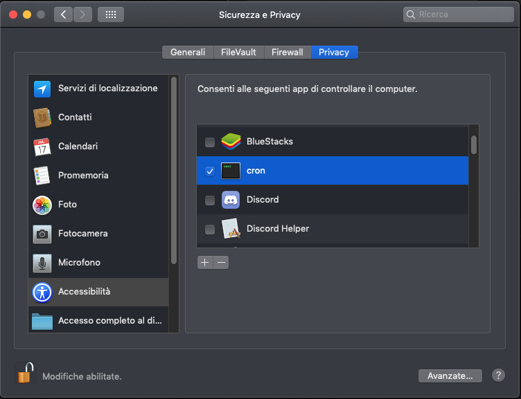

# Django Backend 

<p align="center" style="font-size: 24px">
  <span> English </span> |
  <a href="#">Italiano</a>
</p>

## Advanced Programming Languages 2020/2021
### Developed by:
- **Bartolomeo Caruso**
- **Giuseppe Fallica**
- **Gabriele Costanzo**

---

## 1. What we used
In order to develop the Recommendation System backup, we used the following CRAN packages:
- **here** - A simple package for path traversing, starting from the CWD, useful for calling Rscript calls automation
- **rjson** - Implements *fromJSON* and *toJSON* functions to translate lists and dataframes in JSON format, and vice versa
- **httr** - General-purpose HTTP library with built-in JSON parsing and headers support, used for the WebClient
- **recommenderlab** - Suite of tools for building recommendation systems, supporting different formats and methods
- **cronR** - For scheduling tasks in UNIX environments
- **taskscheduleR** - For scheduling tasks in Windows environments

---

## 2. Server startup
The Rserver supposes a Django backend already up and running in the background, at startup.
It works by executing a `main.R` script that generates the job schedule on the user's OS.
The scheduled task already includes a method to empty the job schedule if the Django web server is closed.

0. If on a UNIX system (Ubuntu, macOS), make sure that the `cron` process is running:
- **Start the cron process:**
  ```bash
    $ sudo cron
  ```
  If on **macOS**, it may be necessary to add the **Terminal** app and/or the **cron** binary to the apps that can control the computer under *"Security & Privacy"* 
  
  
  - **cron location:**
  ```bash
    $ which cron
    /usr/sbin/cron
  ```
  - **Terminal location:**
  ```bash
    /Applications/Utilities/Terminal.app
  ```

1. Start the Django backend:
-  **Start Django (view Django's README):**
  ```bash
    $ cd Django
    $ python3 manage.py runserver 0.0.0.0:8000 --noreload
  ```

2. Initialize the Rserver:
-  **Start main.R:**
  ```bash
    $ cd Rserver
    $ sudo R < main.R --no-save
  ```

3. X: (Optional) manually stop the R server:
-  **Start terminate.R:**
  ```bash
    $ cd Rserver
    $ sudo R < terminate.R --no-save
  ```