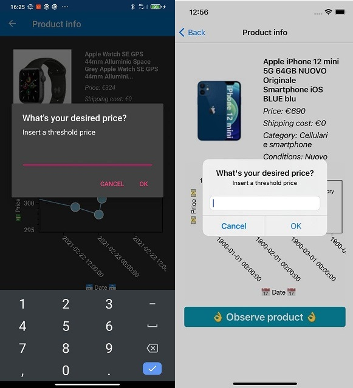

# Django Frontend 

<p align="center" style="font-size: 24px">
  <span> English </span> |
  <a href="#">Italiano</a>
</p>

## Advanced Programming Languages 2020/2021
### Developed by:
- **Bartolomeo Caruso**
- **Giuseppe Fallica**
- **Gabriele Costanzo**

---

## 1. What we used
In order to develop this frontend we have used the following elements:
- **Xamarin.Forms:** is an open source cross-platform framework from Microsoft for building iOS, Android, & Windows apps with .NET from a single shared codebase.
- **Xamarin.Essentials:** A kit of essential API's for Xamarin.Forms.
- **Newtonsoft.Json:** is a popular high-performance JSON framework for .NET.
- **OxyPlot.Xamarin.Forms:** is a plotting library for .NET. This package includes a portable library for Xamarin.Forms apps and platform-specific libraries for IOS and Android.
- **System.Net.Http:** provides a programming interface for modern HTTP applications, including HTTP client components that allow applications to consume web services over HTTP and HTTP componenets that can be used by both clients and servers for parsing HTTP headers.
- **NETStandard.Library:** a set of standard .NET API's that are prescribed to be used and supported together.
- **Microsoft.Net.Http:Headers:** HTTP header parser implementations.

---

## 2. Frontend setup
Our application uses ngrok to allow communication between our backend and the frontend, it constitutes a service that allows to create a local tunnel between a local port and a public URLs and inspect traffic. For this reason it is necessary to modify the secrets.json file in the Configuration folder of our project by setting the URL provided by ngrok as in the following example.  
- **Configuration/secrets.json:**
  ```JSON
    {
      "ngrok": "http://65160599d543.ngrok.io"
    }
  ```

---

## 3. Pages

Xamarin generates two files when creating a new page:
File .xaml: the actual aesthetics of the page are implemented in it.
File .xaml.cs: all the operating logic behind the page it is associated with is implemented in it.

- **LoginPage:** This page allows a registered user to request access to the services provided by the application by correctly providing the email and password chosen at the time of registration.

    Using ProductSerializer we are able to serialize a Product instance as shown down below: 
    ```JSON
      {
        "id": 1,
        "item_id": "402697978785",
        "title": "Nintendo DS Lite Nero con R4 + 40 Giochi Preinstallati ",
        "subtitle": "Leggero e portabile",
        "category_id": "139971",
        "category_name": "Console",
        "gallery_url": "https://thumbs2.ebaystatic.com/m/mQSTsb3LhaQHqyNC3jBuLJg/140.jpg",
        "view_url": "https://www.ebay.it/itm/Nintendo-DS-Lite-Nero-con-R4-40-Giochi-Preinstallati-/402697978785",
        "shipping_cost": "8.00",
        "price": "38.90",
        "condition_id": "3000",
        "condition_name": "Usato",
        "created_at": "2021-02-20T00:24:50.765+00:00",
        "updated_at": "2021-02-20T00:24:50.765+00:00"
      }
    ```

- **Observations Page:** This page is used to show every product observed by the logged user.
    Every observed product is inserted inside the page as a grid element as shown below:

  

  Thanks to this page our app user is able to delete or modify it's own observations pressing the modify button.
  When the button is pressed, a display prompt appears, as shown below:

  

  The display prompt permits two actions:

  - `Update Observation`: to change the observation price threshold. If pressed an input box is showed to the user.

  - `Delete Observation`: to delete the observation

  Price threshold update input box is showed down below: 

  


- **Recommendation page:** This page is used to show recommended product for the user, that are gathered from our recommendation system.
Every recommended product is inserted inside the page as a grid element as shown below:

  

  Every recommended product is associated with an info button, which if pressed navigates the user to a proper product info page.


- **Notification page:** This page is used to show every notification sent to the user, even the old ones.

  

  Thanks to this page the user is able to read all the received notifications, and he is able to delete the old ones.


- **Search page:** This page is used to search a product using ebay API. When the search input box is filled with a keyword, the space down below the box is filled with the products that matched the query.  

  

  Each received product is associated with an info button, which if pressed navigates the user to a proper product info page.

  


- **Product info page:** This page is used to show all the useful details of a product and to show a price history graph to the user.

  

  At the bottom of this page there is a button, which if pressed shows to the user a desired price input box.

  

  If a valid price is inserted inside the input box, and if the current user hasn't already observed the product, a new observation will be created.
  

  
---

## 4. Http Requests

---

## 5. Notifications


---
